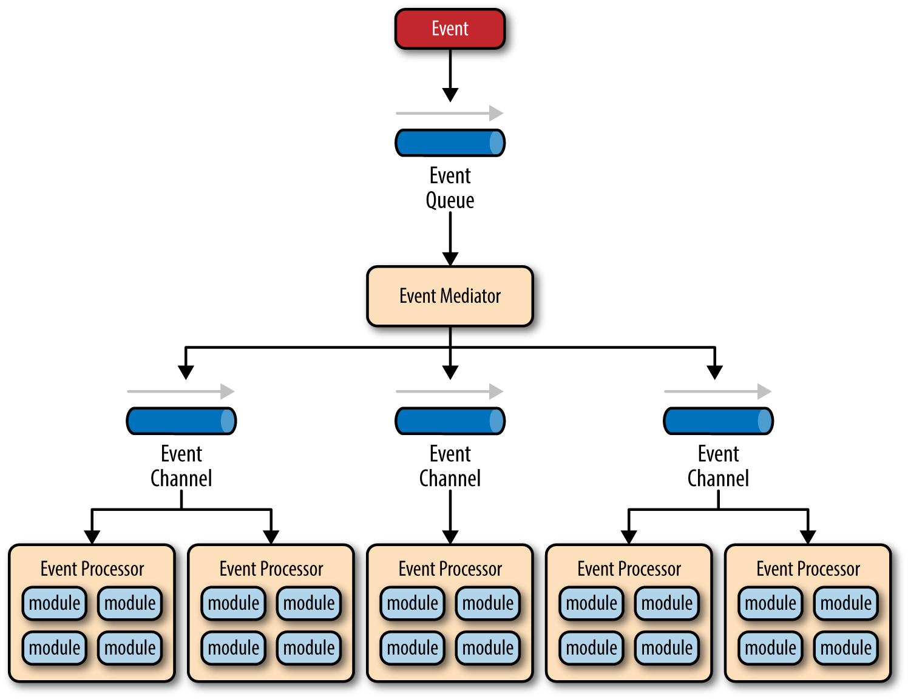

# 1 Layered Architecture

အသုံးများဆုံး မြင်တွေ့နေကျဖြစ်တဲ့ pattern တခုကတော့ layered architecture တနည်းအားဖြင့် n-tier architecture pattern ပါပဲ။ သူက Java EE application တော်တော်များများမှာ ပုံမှန်တွေ့နေကျ ပြီးတော့ architect, developer တွေနဲ့ designers တွေအတွက် မစိမ်းတဲ့ pattern တခုပါ။ သူက business application တော်တော်များများအတွက် ကိုက်ညီပြီး company အများစုမှာတွေ့ရလေ့ရှိတဲ့ structures နဲ့လည်းကိုက်ညီတဲ့ pattern တခုလည်းဖြစ်တယ်။

### Pattern Description

Pattern မှာရှိတဲ့ Components တွေကို horizontal layer တွေအနေနဲ့ဖွဲ့စည်းထားမယ်။ layerတခုစီက သီးသန့် roleတွေအနေနဲ့ ကိုယ်စားပြုကြမယ်။  layerဘယ်နှခုပါ၀င်ရမယ် ဘယ်လို typeအနေနဲ့ ပါ၀င်ရမယ်ဆိုတာ ကို ကန့်သန့်ထားတာမျိုးတော့မရှိပေမဲ့ များသောအားဖြင့် စံတခုအနေနဲ့တော့ (presentation, business, persistence, database) ဆိုပြီး layer ၄ ခုရှိတယ် (figure 1.1) ။ တချို့တွေက business layer နဲ့ persistence ကို ပေါင်းပြီး business layer ဆိုပြီး သုံးကြတာ သတ်မှတ်ကြတာတွေလည်းရှိတယ်။ ဒီလိုနဲ့ application အရွယ်စားပေါ်မူတည်ပီး layer ၃ခုထဲ ရှိတာလည်းဖြစ်နိုင်သလို ပိုပြီး ကြီးမား ရှုပ်ထွေးတဲ့ systemတွေမှာ ၅ ခုနဲ့အထက်လည်းဖြစ်နိုင်တယ်။

ဒီ layered architecture patternမှာ layerတခုစီမှာ သီးသန့် role နဲ့ responsibility တွေရှိကြတယ်။ ဥပမာ၊ presentation layer က user interface နဲ့သက်ဆိုင်တဲ့ အရာတွေ browser communication logicနဲ့ ဆိုင်တဲ့အရာတွေကို တာ၀န်ယူထားပြီး business layer ကတော့ user requestတွေနဲ့ပတ်သက်ပြီး business ruleတွကို လုပ်ဆောင်ပေးမယ်။  layer တခုစီဟာ သူတို့နဲ့သတ်ဆိုင်တဲ့ အလုပ်တွေကိုသာလျှင် သီးသန့်လုပ်ဆောင်ပေးကြတာမျိုးဖြစ်တယ်။ တနည်းအားဖြင့် presentation layer ဟာ customer dataတွေ ဘယ်လိုရတာတွေ ဘယ်မှာ သိမ်းမှာတွေ သိနေစရာ စိတ်ပူနေစရာမလိုဘူး။ သူ့အလုပ်ဖြစ်တဲ့ screen မှာ ဘယ်လိုဘယ်ပုံ ပြမယ်ဆိုတာကသာ သူ့ရဲ့ အလုပ်ဖြစ်တယ်။ ဒီတော့ သူ့ရဲ့ scopeက ရှင်းရှင်းလင်းလင်း သတ်မှတ်ပြီးသားဖြစ်လို့နေတယ်။

<figure><figcaption>
Figure 1-1 Layered Architecture Pattern
</figcaption></figure>

ဒါ့ကြောင့် ဒီpatternရဲ့ powerful ဖြစ်တဲ့ featureတခုက componentsတွေကို သူ့အလုပ်တာ၀န် သူ့အကန့်လေးနဲ့ သူခွဲထုတ်ထားနိုင်ခြင်းလို့ ပြောရင်မမှားပါဘူး။ componentတွေက သူတို့နဲ့ သက်ဆိုင်တဲ့အလုပ်ကလွဲရင် ကျန်တာ စိတ်ပူနေစရာမလိုပါဘူး။ အဲလိုမျိုး အမျိုးစားခွဲထုတ် စီစစ်ပြီး layer တွေခွဲလိုက်တဲ့အခါ architectureတခုမှာ role and responsibility လည်းရှင်းလင်းသွားပြီး၊ scopeလည်း ကန့်သတ်ထားပြီးသားဖြစ်လို့ developလုပ်ရတာ testing and maintenanceပိုင်းမှာ လွယ်ကူသွားပါတယ်။&#x20;

Layered Pattern မှာအဓိကအရေးကြီးတဲ့ အချက်ကတော့ layerတခုစီက သီးသန့်လုံး၀ ပိုင်းခြားထားတာ တနည်းအားဖြင့် အလုံပိတ်ထားတာပဲဖြစ်တယ်။ ဆိုလိုတာက request တခုက layer တခုကနေ တခုကို ရွေ့ကို ရွေ့သွားရပါတယ်။ တဆင့်စီ သူ့ရဲ့အောက် တဆင့်ဆီ ဆက်တိုက် ဆင်းသွားရတာမျိုးပါ။ presentation layer ကလာတဲ့ requestတခုဟာ ပထမဆုံး business layer၊ နောက် persistence layer ၊ နောက်ဆုံး database layerထိ ဆင်းသွားရတာမျိုးပါ။ ဥပမာ ပုံ (၂) ကိုကြည့်ပါ။

<figure><figcaption>
Figure 1-2. Closed Layers and Request access
</figcaption></figure>

ဘာလို့ presentation layer ကနေ Database layerကို ဖြစ်ဖြစ် Persistence layerကိုဖြစ်ဖြစ်တိုက်ရိုက် accessလုပ်ခွင့် မပေးတာလဲ ? presentation ကနေ database ကိုသာ တိုက်ရိုက် accessရမယ်ဆိုရင် သူ့ကြားထဲက မလိုအပ်တဲ့ layer တွေကြောင့် နှောင့်နှေးနေစရာမလိုဘဲ မြန်ဆန်မသွားနိုင်ဘူးလား ? သူ့အတွက် အဖြေကတော့ ဒီ patternရဲ့ အဓိက concept က layer isolationကြောင့်ပဲလို့ ပြောရမှာပါပဲ။ layer isolationဆိုတဲ့သဘောတရားက  layer တခုရဲ့ ပြောင်းလဲမှုက တခြားမသက်ဆိုင်တဲ့ layerပေါ် အကျိုးမသက်ရောက်စေခြင်းပဲဖြစ်တယ်။ တကယ်လို့များ presentation layer က persistence layerကို တိုက်ရိုက် access ရထားမယ်ဆိုပါစို့။ persistence layer မှာရှိတဲ့ SQL အပြောင်းအလဲဟာ business layer နဲ့  presentation layer မှာ သက်ရောက်မှုရှိလာမယ်။ အဲလိုနည်းနဲ့ပဲ components တွေဟာ tightly coupled ဖြစ်လာမယ်။ ဒီလိုမျိုးarchitecture ဟာ အပြောင်းအလဲ တခုခုလုပ်ဖို့ဆိုရင် ခက်ခဲပြီး အကုန်အကျများပါတယ်။  ဒါ့ကြောင့် isolation concept ဟာ layer တခုနဲ့တခု အဆက်စပ် မရှိ၊ ပတ်နွယ်မှုမရှိဘဲ အလုပ်အတူတူ တွဲလုပ်နိုင်ခြင်းကို ရည်ရွယ်ပါတယ်။  ဒီ concept ရဲ့ သဘောတရားနဲ့ သူ့ power ကိုနားလည်ဖို့ဆိုရင်တော့ ဥပမာ၊ JSP ( Java Server Pages) နဲ့ရေးထားတဲ့ persentation layer ကို JSF ( Java Server Faces)  နဲ့  refactoring လုပ်ပြီး ပြောင်းရေးမယ်ဆိုပါစို့။ Presentation layerရဲ့အပြောင်းအလဲဟာ Business layer ပေါ်မှာ မသက်ရောက်ဘူး။ user-interfase framework ဘာပဲသုံးသုံး သူကတော့ အရင်တိုင်းပဲ၊ လိုက်ပြောင်းလဲစရာမလိုအပ်ဘူး။ ဘယ်လောက် အဆင်ပြေလိုက်လဲ။&#x20;

ဟုတ်ပြီ၊ ဒီလိုဆို closed layer က အပြောင်းအလဲ လုပ်ဖို့ အဆင်ပြေတယ်ဆိုရင် open layer ကကော ထည့်သုံးမယ်ဆို အဆင်ပြေနိုင်လား ? လို့မေးစရာရှိလာပါတယ်။ တခါတလေမှာတော့ open layer တွေရှိဖို့ သုံးဖို့လိုအပ်တာမျိုး ရှိပါတယ်။ ဥပမာ၊ ကိုယ်က business layer ထဲမှာရှိတဲ့ component ကနေ access လုပ်လို့ရတဲ့ common service component တခုကို shared-service layer အနေနဲ့ ထည့်ချင်တယ်။ အဲဒီ common service components မှာ data utility classes တွေ auditing/logging classes တွေပါမယ်ပေ့ါ။ အဲဒီ shared-service layer က business layer ကပဲ access လုပ်လို့ရမယ် (တနည်းအားဖြင့် presentation layerက access လုပ်လို့မရဘူး။ ) ဒီလို  shared-service layerထည့်လိုက်တာဟာ ယေဘူယျအားဖြင့်တော့ ကောင်းတဲ့ ideaတခုဖြစ်တယ်။ isolation layerဖြစ်တဲ့အတွက် ထူးထွေပြီး ကန့်သန့်ထားစာရာမလိုဘူးပေ့ါ။  ဒါပေမဲ့ အဲဒီမှာ ပြဿနာ တခုရှိတာက business layer ကနေ persistence layer ကို ရောက်ဖို့ အရင်ဆုံး shared-service layerကိုဖြတ်ဖို့လိုလာတယ်။  ဒါက သိပ်တော့အဆင်ပြေမနေဘူး။ အဲဒီ အတွက် ကြောင့် layered architecture  မှာ open layers တွေထည့်ဖို့ လိုအပ်လာတယ်။&#x20;

shared-service layerကို open layerအနေနဲ့ထားလိုက်မယ်။ တနည်းအားဖြင့် request တွေက အဲlayerကိုဖြတ်ပြီး ပဲဖြစ်ဖြစ် တိုက်ရိုက် သူ့အောက်က layerကိုပဲဖြစ်ဖြစ် access လုပ်ခွင့်ရှိမယ်။ ပုံ (၃) ကိုကြည့်ပါ။ ဒါဆိုရင် business layer ဟာ shared service layer အောက်က presentation layer ကိုတိုက်ရိုက် access လုပ်ခွင့်ရသွားပါပြီ။ ဒါလိုကမှ အဆင်ပြေဆုံးဖြစ်သွားမှာပေါ့။

<figure><figcaption>
Figure 1-3 : Open layer and request flow
</figcaption></figure>

အထက်ကပြောခဲ့သလိုမျိုး open / closed layer တွေရဲ့ သဘောတရားတွေကို အသုံးချပြီးတော့ request flow တွေ layerအချင်းချင်းကြားက relationship တွေကို သတ်မှတ်ဖို့ နားလည်ဖို့ဆိုတာ designers နဲ့ developers တွေမှာ လိုအပ်ပါတယ်။ ဒီ open/closed layer သဘောတရားတွေမှာ တခုခုလွဲသွားခဲ့မယ်ဆိုရင် tightly coupled  architecture ဖြစ်သွားပြီး testing, maintenance နဲ့ deployအပိုင်းတွေမှာ ခက်ခဲသွားနိုင်ပါတယ်။&#x20;
